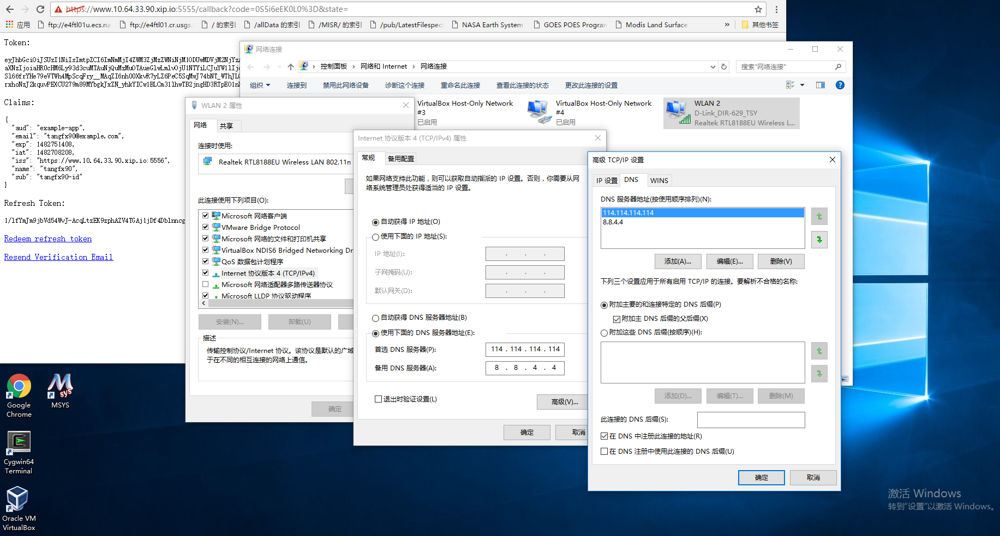

Content
--------

Change Log

* Nov 6 2016, 1st distribution, Git Revision: 4b9bdf163db85373f3ea59bb227dec445c618cbf

### Binary

In current branch
    
    [tangfx@localhost dex]$ ls bin
    dexctl  dex-overlord  dex-worker  example-app  example-cli  gendoc

    [tangfx@localhost dex]$ dex-worker --version
    dex version 4b9bdf163db85373f3ea59bb227dec445c618cbf-dirty
    go version 1.6.2

### Certification

Via *Kubernetes* Certification tool

    [tangfx@localhost ~]$ mkdir -p kubernetes/saltbase

    [tangfx@localhost ~]$ scp -r ubuntu@192.168.56.10:/home/ubuntu/kubernetes/server/kubernetes/saltbase kubernetes/
    The authenticity of host '192.168.56.10 (192.168.56.10)' can't be established.
    ECDSA key fingerprint is SHA256:tmHaFlR8KqSPhgaQJKM9q2oKlNhNLrlhvTE+B9N8HQE.
    ECDSA key fingerprint is MD5:40:e2:a9:3a:ca:67:a3:db:4d:7a:72:4b:ae:5f:63:84.
    Are you sure you want to continue connecting (yes/no)? yes
    Warning: Permanently added '192.168.56.10' (ECDSA) to the list of known hosts.
    ubuntu@192.168.56.10's password:

    [tangfx@localhost ~]$ scp -r ubuntu@192.168.56.10:/home/ubuntu/easy-rsa.tar.gz .
    ubuntu@192.168.56.10's password:
    easy-rsa.tar.gz                               100%   42KB  42.4KB/s   00:00

    [tangfx@localhost ~]$ scp -r ubuntu@192.168.56.10:/home/ubuntu/salt-make-ca-cert.sh .
    ubuntu@192.168.56.10's password:
    salt-make-ca-cert.sh                          100%  369     0.4KB/s   00:00

    [tangfx@localhost ~]$ vi salt-make-ca-cert.sh

    [tangfx@localhost ~]$ ./salt-make-ca-cert.sh
    IP:10.64.33.90,IP:10.0.2.15,IP:127.0.0.1,DNS:www.10.64.33.90.xip.io,DNS:accounts.10.64.33.90.xip.io
    Create ca cert into /srv/kubernetes
    chgrp: changing group of ‘/srv/kubernetes/server.key’: Operation not permitted
    chgrp: changing group of ‘/srv/kubernetes/server.cert’: Operation not permitted
    chgrp: changing group of ‘/srv/kubernetes/ca.crt’: Operation not permitted
    [tangfx@localhost ~]$ ls /srv/kubernetes/
    ca.crt  kubecfg.crt  kubecfg.key  server.cert  server.key

    [tangfx@localhost dex]$ /go/bin/dex-worker --tls-cert-file="/srv/kubernetes/server.cert" --tls-key-file="/srv/kubernetes/server.key" --listen="https://0.0.0.0:5556" --issuer="https://www.10.64.33.90.xip.io:5556" --issuer-name=dex --clients="/go/src/github.com/coreos/dex/static/fixtures/clients.json" --connectors="/go/src/github.com/coreos/dex/static/fixtures/connectors.json" --email-cfg="/go/src/github.com/coreos/dex/static/fixtures/emailer.json" --users="/go/src/github.com/coreos/dex/static/fixtures/users.json" --html-assets="/go/src/github.com/coreos/dex/static/html" --enable-registration=true --no-db --log-debug=true --log-timestamps=true
    WARN: Running in-process without external database or key rotation
    INFO: Loaded IdP connector: id=local type=local
    INFO: Loaded IdP connector: id=google type=oidc
    INFO: Loaded IdP connector: id=github type=github
    INFO: Loaded IdP connector: id=bitbucket type=bitbucket
    WARN: bindTemplate not used when searchBeforeAuth specified.
    INFO: Loaded IdP connector: id=ldap type=ldap
    INFO: Binding to 0.0.0.0:5556...

### Daemon

Fedora 23

    [tangfx@localhost dex]$ sudo mkdir -p /etc/coreos/dex

    [tangfx@localhost dex]$ sudo cp /srv/kubernetes/ca.crt /srv/kubernetes/server.* /etc/coreos/dex

    [tangfx@localhost dex]$ sudo systemctl enable coreos-dex.service

    [tangfx@localhost dex]$ sudo systemctl start coreos-dex.service
    
    [tangfx@localhost dex]$ sudo systemctl -l status coreos-dex.service
    ● coreos-dex-dev.service - CoreOS Dex OIDC Server
       Loaded: loaded (/etc/systemd/system/coreos-dex.service; enabled; vendor preset: disabled)
       Active: active (running) since Mon 2016-11-07 00:20:24 CST; 5min ago
         Docs: https://github.com/coreos/dex
     Main PID: 22290 (dex-worker)
       Memory: 5.4M
          CPU: 1.833s
       CGroup: /system.slice/coreos-dex.service
               └─22290 /go/bin/dex-worker --tls-cert-file=/srv/kubernetes/server.cert --tls-key-file=/srv/kubernetes/server.key --listen=https://0.0.0.0:5556 --issuer=https://www.10.64.33.90.xip.io:5556 --issuer-name=dex --clients=/go/src/github.com/coreos/dex/static/fixtures/clients.json --connectors=/go/src/github.com/coreos/dex/static/fixtures/connectors.json --email-cfg=/go/src/github.com/coreos/dex/static/fixtures/emailer.json --users=/go/src/github.com/coreos/dex/static/fixtures/users.json --html-assets=/go/src/github.com/coreos/dex/static/html --enable-registration=true --no-db --log-debug=true --log-timestamps=true

Example
               
    [tangfx@localhost dex]$ ./bin/example-app --client-id=example-app --client-secret=ZXhhbXBsZS1hcHAtc2VjcmV0 --discovery=https://www.10.64.33.90.xip.io:5556 --listen="https://10.64.33.90:5555" --redirect-url="https://www.10.64.33.90.xip.io:5555/callback"  --tls-cert-file="/srv/kubernetes/server.cert" --tls-key-file="/srv/kubernetes/server.key" --trusted-ca-file="/srv/kubernetes/ca.crt" --log-debug=true --log-timestamps=true
    INFO: Fetched provider config from https://www.10.64.33.90.xip.io:5556: oidc.ProviderConfig{Issuer:(*url.URL)(0xc820016b00), AuthEndpoint:(*url.URL)(0xc820016b80), TokenEndpoint:(*url.URL)(0xc820016c00), UserInfoEndpoint:(*url.URL)(nil), KeysEndpoint:(*url.URL)(0xc820016c80), RegistrationEndpoint:(*url.URL)(nil), EndSessionEndpoint:(*url.URL)(nil), CheckSessionIFrame:(*url.URL)(nil), ScopesSupported:[]string(nil), ResponseTypesSupported:[]string{"code"}, ResponseModesSupported:[]string(nil), GrantTypesSupported:[]string{"authorization_code", "client_credentials"}, ACRValuesSupported:[]string(nil), SubjectTypesSupported:[]string{"public"}, IDTokenSigningAlgValues:[]string{"RS256"}, IDTokenEncryptionAlgValues:[]string(nil), IDTokenEncryptionEncValues:[]string(nil), UserInfoSigningAlgValues:[]string(nil), UserInfoEncryptionAlgValues:[]string(nil), UserInfoEncryptionEncValues:[]string(nil), ReqObjSigningAlgValues:[]string(nil), ReqObjEncryptionAlgValues:[]string(nil), ReqObjEncryptionEncValues:[]string(nil), TokenEndpointAuthMethodsSupported:[]string{"client_secret_basic"}, TokenEndpointAuthSigningAlgValuesSupported:[]string(nil), DisplayValuesSupported:[]string(nil), ClaimTypesSupported:[]string(nil), ClaimsSupported:[]string(nil), ServiceDocs:(*url.URL)(nil), ClaimsLocalsSupported:[]string(nil), UILocalsSupported:[]string(nil), ClaimsParameterSupported:false, RequestParameterSupported:false, RequestURIParamaterSupported:false, RequireRequestURIRegistration:false, Policy:(*url.URL)(nil), TermsOfService:(*url.URL)(nil), ExpiresAt:time.Time{sec:63614131532, nsec:484770817, loc:(*time.Location)(0xab2780)}}
    INFO: Binding to :5555...
    INFO: Key and cert file provided. Using TLS
    INFO: URL: https://www.10.64.33.90.xip.io:5556/auth?client_id=example-app&redirect_uri=https%3A%2F%2Fwww.10.64.33.90.xip.io%3A5555%2Fcallback&register=1&response_type=code&scope=openid+email+profile+offline_access&state=
    ^C

Trial

Remember to set host DNS for example:    